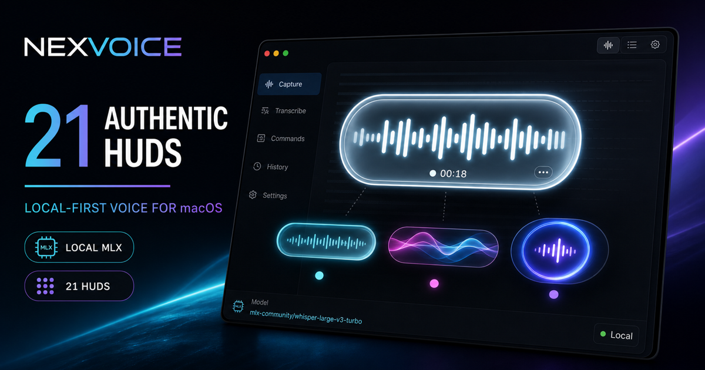

<p align="center">
  <h1 align="center">NexVoice</h1>
  <p align="center"><b>macOS 原生本地優先語音輸入與 AI 文本修飾系統</b></p>
  <p align="center">
    <a href="https://github.com/awe7893625/nexvoice"></a>
    <a href="LICENSE"></a>
    
    
    
  </p>
</p>

<p align="center">
  
</p>

<p align="center">
  <a href="https://github.com/awe7893625/nexvoice"><b>⭐ 為本專案點亮 Star</b></a> •
  <a href="https://nexvoice-ai.movielin8866.workers.dev"><b>🌐 Live HUD 展示預覽</b></a> •
  <a href="https://github.com/awe7893625/nexvoice/archive/refs/heads/main.zip"><b>📦 下載原始碼 (.zip)</b></a> •
  <a href="https://github.com/awe7893625/nexvoice/issues"><b>💬 回報問題 / Issues</b></a> •
  <a href="https://github.com/awe7893625/nexvoice/releases"><b>🚀 版本發佈 / Releases</b></a>
</p>

---

## 🌟 項目簡介與產品亮點 (Product Overview)

NexVoice 是一款專為 **Apple Silicon (macOS 14.0+)** 打造的原生語音聽寫與 AI 增強工具。按下快捷鍵即可啟動錄音，再次按下或放開熱鍵即自動完成語音轉文字（STT）並貼上至當前游標位置。預設採用本地 **MLX Whisper** 引擎，資料完全不離開 Mac，達成零成本、高隱私與極致響應速度。

### 🎨 拟真 macOS 錄音 HUD 與視覺風格

- **真實 macOS 錄音 HUD**：流暢無縫的 SwiftUI Canvas / GraphicsContext 視覺渲染，支援單擊開關 (Toggle) 與長按說話 (Push-to-Talk)。
- **21 種 HUD 渲染器風格 (Renderers)**：包含 *亮條*, *膠囊光暈*, *等離子柱*, *液態脈衝*, *流光絲帶*, *琉璃*, *極光*, *光球*, *虹核*, *赤霞*, *彗尾*, *雙螺旋*, *水銀*, *電漿*, *日蝕*, *煙霧*, *橫煙*, *海浪*, *絲綢氣流*, *極光霧*, *墨滴擴散*。
- **3 大視覺主題 (Themes)**：純淨 (Pristine)、設計工房 (Studio)、曜石 (Obsidian)。
- **7 種邊框處理 (Frames)**：無邊框、髮絲細邊、流光邊、呼吸光環、超薄無底、微光流體、浮雕。

### ⚡ 熱鍵貼上流 (Hotkey-to-Paste Flow)

- 原生快捷鍵狀態機，確保高頻觸發下的極速響應。
- 內建防重複貼上 (Duplicate-paste prevention) 機制，確保語音轉寫文字準確無誤地輸入目標應用程式。

### 🤖 靈活的模型路由 (Model Routing)

- **本地優先 (Local-First)**：預設使用 Apple Silicon 專屬 MLX Whisper 進行本地語音轉文字 (STT) 以及本地 Ollama 模型進行文本潤飾。
- **可選雲端擴充 (Opt-in Cloud)**：Gateway 雲端 STT 支持 Gemini；雲端文本修飾可選擇性接入 Groq, NVIDIA NIM 或 Gemini。App 端亦直接支援 Groq 與 Gemini 整合（Groq 使用 OpenAI 相容 API），且 Gateway 提供 OpenAI 相容的子集 (OpenAI-compatible subset) API 端點 (`/v1/audio/transcriptions`)。

### 🤖 AI 自動配置 CLI / REST 與安全隱私

- **Agent 友善 CLI & REST**：提供 `python3 server/agent_cli.py doctor` 自動診斷與配置，亦支援 `POST /api/settings` REST 介面。
- **安全與隱私預設 (Security & Privacy Defaults)**：敏感端點均需驗證 `X-NexVoice-Token` 標頭；絕對無任意遠端指令執行能力，預設嚴格維持資料本地化。

---

## 🚀 快速安裝與啟動 (Quick Install & Gateway)

### 1. 一鍵安裝腳本

```bash
curl -fsSL https://raw.githubusercontent.com/awe7893625/nexvoice/main/install.sh | zsh
```
*(若使用 AI 助手安裝，請參考 [`llms-install.md`](llms-install.md) 了解詳細步驟導引)*

### 2. 啟動 Python Gateway 服務

```bash
python3 server/app.py
```

---

## 💻 API 使用範例 (API Example)

NexVoice Gateway 提供 OpenAI 相容子集 (OpenAI-compatible subset) 的語音轉寫 API 端點 (`/v1/audio/transcriptions`)：

```bash
curl -X POST http://127.0.0.1:5111/v1/audio/transcriptions \
  -H "X-NexVoice-Token: YOUR_TOKEN_HERE" \
  -F "file=@/path/to/audio.wav" \
  -F "model=mlx-community/whisper-large-v3-turbo"
```

詳細介面說明請參閱 [docs/LOCAL_RUNTIME_AND_PROVIDERS.md](docs/LOCAL_RUNTIME_AND_PROVIDERS.md) 與 [docs/PRIVACY.md](docs/PRIVACY.md)。

---

## 🏗️ 系統架構摘要 (Architecture Summary)

```text
[ macOS App (SwiftUI) ] <--- Global Hotkey & Audio Capture
       │
       ├──> Local MLX Whisper Service (:5112) / Ollama
       │
       └──> Python Loopback Gateway (:5111)
                 │
                 ├──> Local / Cloud STT (Gemini)
                 └──> Local / Cloud LLM Cleanup (Groq, NIM, Gemini)
```

- **App 層**：Native macOS SwiftUI + Hotkey State Machine + 21 HUD Renderers。
- **服務層**：經認證的 MLX 輔助進程 (`:5112`) 與本地 Loopback HTTP Gateway (`:5111`)。
- **測試驗證**：涵蓋 Swift 單元測試、運行時 Contract 測試與 Python Gateway 測試套件 (`pytest server/`)。

---

## 🛠️ 建置與測試 (Build & Test)

```bash
# 執行 Python Gateway 與 Agent 測試
pytest server/

# 建置 Web Showcase (Cloudflare Worker 兼容) 網站
npm --prefix website run build

# 建置並測試 macOS SwiftUI 應用程式
cd macos && swift test
```

---

## 🤝 參與貢獻 (Contributing)

歡迎提交 Issue 或 Pull Request！無論是修復 Bug、優化 HUD 視覺效果，還是增加新的 LLM 潤飾 Provider，都非常感謝社群的參與與貢獻。詳情請閱讀 [CONTRIBUTING.md](CONTRIBUTING.md)。

---

## ⭐ 支持專案 (Star History)

如果 NexVoice 對您的日常工作或開發有所幫助，請給本專案點亮一顆 **Star** ⭐️，這將是我們持續維護與更新的最大動力！

[👉 點擊這裡前往 GitHub 為 NexVoice 點亮 Star](https://github.com/awe7893625/nexvoice)

---

## 📄 開源許可證 (License)

本專案採用 [MIT License](LICENSE) 開源許可證。
