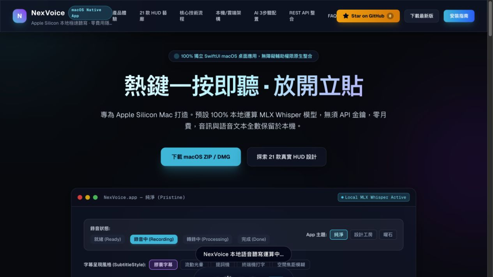
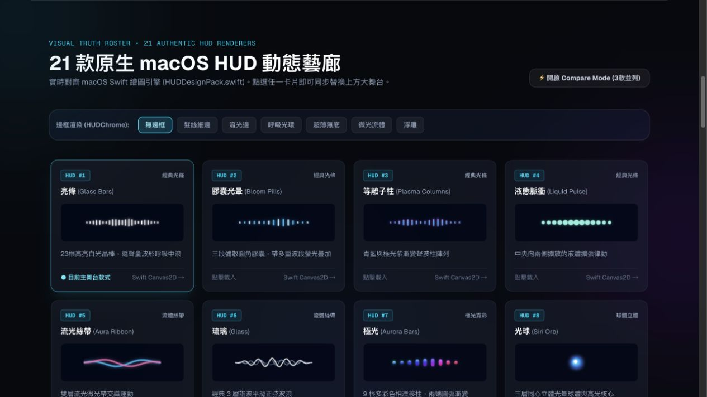
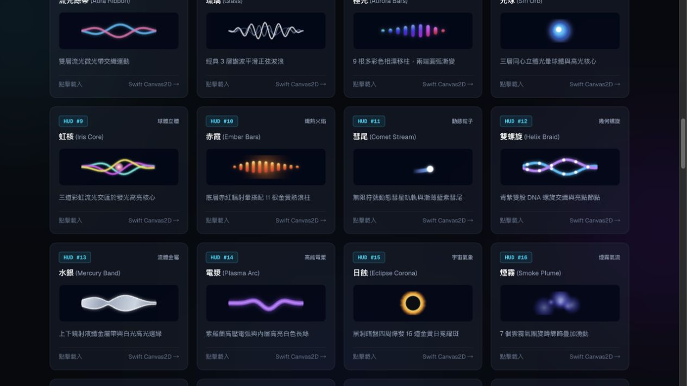
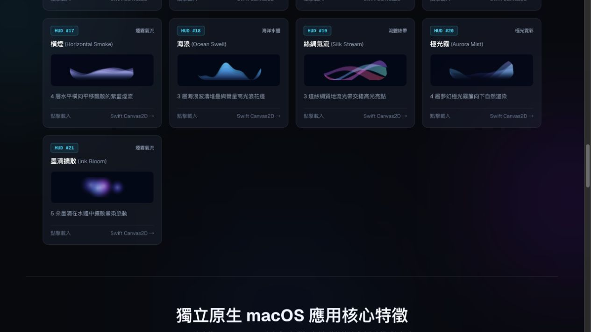
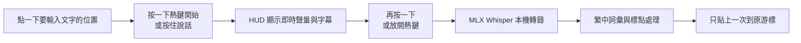

<div align="center">

# NexVoice

**Apple Silicon 上的本地優先語音輸入、21 款動態 HUD 與 AI 可配置 Gateway**

[](../../actions/workflows/test.yml)
[](../../releases/latest)
[](LICENSE)
[](#平台支援)
[](../../stargazers)

[🌐 互動式產品網站](https://nexvoice-ai.movielin8866.workers.dev) ·
[⬇️ 下載最新版](../../releases/latest) ·
[⭐ Star](../../stargazers) ·
[📖 AI 安裝指南](llms-install.md) ·
[🧩 Agent Skill](SKILL.md)

</div>



> NexVoice 是獨立的原生 macOS App，不需要和其他聽寫工具綁在一起。
> 按一下熱鍵開始、再按一下停止，或按住說話、放開完成；文字會貼到目前游標位置。

## 為什麼選 NexVoice

| 能力 | NexVoice |
|---|---|
| 語音轉文字 | Apple Silicon 上使用 MLX Whisper，本機優先、預設零 API 費用 |
| 操作方式 | Toggle 與 Push-to-Talk，原生全域熱鍵與防重複貼上 |
| 視覺介面 | 21 款 HUD、7 種外框、5 種字幕、3 種 App 主題 |
| 繁體中文 | 本地標點口令、詞彙偏置、sounds-like 修正與最長詞優先 |
| AI 整理 | 本機 Ollama；Gemini、Groq、NVIDIA NIM 必須明確啟用 |
| AI 配置 | 穩定 JSON CLI、硬體診斷、安全 auto-tune、`SKILL.md` |
| API | Token 驗證的 Loopback REST 與 OpenAI-compatible transcription subset |
| 隱私 | 音訊預設不離開 Mac；雲端路由需設定、開關與隱私政策同時允許 |

## 21 款 HUD：這就是實際呈現

下列畫面由網站內與 `HUDDesignPack.swift` 對齊的 Canvas renderer 直接執行後擷取，
不是 AI 生成概念圖；它是 Web 同步 renderer 的展示證據，不冒充原生 App 截圖。
互動網站可切換錄音狀態、主題、外框、字幕與每一款 HUD。







<details>
<summary><b>完整 HUD 名單</b></summary>

1. 亮條 Glass Bars
2. 膠囊光暈 Bloom Pills
3. 等離子柱 Plasma Columns
4. 液態脈衝 Liquid Pulse
5. 流光絲帶 Aura Ribbon
6. 琉璃 Glass
7. 極光 Aurora Bars
8. 光球 Siri Orb
9. 虹核 Iris Core
10. 赤霞 Ember Bars
11. 彗尾 Comet Stream
12. 雙螺旋 Helix Braid
13. 水銀 Mercury Band
14. 電漿 Plasma Arc
15. 日蝕 Eclipse Corona
16. 煙霧 Smoke Plume
17. 橫煙 Horizontal Smoke
18. 海浪 Ocean Swell
19. 絲綢氣流 Silk Stream
20. 極光霧 Aurora Mist
21. 墨滴擴散 Ink Bloom

</details>

## 平台支援

| 平台 | 狀態 | 說明 |
|---|---|---|
| Apple Silicon macOS 14+ | ✅ 主要支援 | 原生 App、HUD、MLX Runtime、Gateway |
| Intel Mac | ⚠️ 有限 | 可建置部分元件；本機 MLX 不支援 |
| Windows | 🟡 API Client | 可串接 Gateway REST API；目前沒有 NexVoice 原生 Windows EXE/HUD |
| Linux | 🟡 API/開發 | 可執行部分 Gateway 測試；沒有原生桌面 App |

我們不會把尚未完成的 Windows App 說成已可下載。Windows 原生客戶端列在
[ROADMAP.md](ROADMAP.md)；現階段可由 Windows 程式透過安全 API 使用 Mac 上的算力。

## 下載與安裝

### 一般使用者

到 [Releases](../../releases/latest) 下載：

- `NexVoice-<version>-macOS.zip`：解壓後點兩下 `Install NexVoice.command`。
- `NexVoice-<version>-macOS.dmg`：掛載後點兩下 `Install NexVoice.command`。
- `SHA256SUMS`：核對下載檔案完整性。

Installer 會把 App 放進 `~/Applications`、建立私有 MLX Python 環境，並下載
`model-manifest.json` 鎖定的 final 與即時字幕模型 revision。模型權重不包在 GitHub Release
裡，所以第一次安裝需要網路；完成後本機轉錄可離線使用。只拖曳 App 而不執行
Installer，Runtime 不會完成配置。

目前公開社群包為 **ad-hoc 簽章、未 notarize**；第一次開啟可能需要在
「系統設定 → 隱私權與安全性」確認。正式 Developer ID/notarization 狀態會在每個
Release 說明中個別標示，不會只靠檔名宣稱。

### 從原始碼一鍵安裝

```bash
curl -fsSL https://raw.githubusercontent.com/awe7893625/nexvoice/main/install.sh | zsh
```

或：

```bash
git clone https://github.com/awe7893625/nexvoice.git
cd nexvoice
zsh install.sh
```

安裝完成後，人類使用者必須在 macOS 系統設定授予：

1. **Microphone**：錄音。
2. **Accessibility**：將結果貼入目前游標位置。

AI 不得自動點擊或繞過這兩項 TCC 權限。

## 給 AI：三個指令完成配置

任何支援 shell 的 AI 助手都可以先讀 [`SKILL.md`](SKILL.md) 與
[`llms-install.md`](llms-install.md)，再依序執行：

```bash
# 1. 非互動式健檢，不顯示任何金鑰值
python3 server/agent_cli.py doctor --json

# 2. 根據架構、記憶體與磁碟提出模型建議（dry run）
python3 server/agent_cli.py tune --json

# 3. 僅原子更新本地模型欄位
python3 server/agent_cli.py tune --json --apply --config ./config.json
```

Auto-tune 安全保證：

- 只修改 `local_model` 與 `cleanup_local_model`。
- 保留 `privacy_mode`、`cloud_enabled`、provider 設定與未知欄位。
- 拒絕 symlink、非 JSON object 與超大設定檔。
- 同目錄暫存、`fsync`、原子替換，並同步 Gateway 實際使用的 SQLite 設定。
- JSON 或資料庫啟用失敗時回滾，不會只顯示 APPLIED 卻保留舊模型。
- Benchmark 只報告真實測量；沒有 WAV、依賴或快取模型就回傳 `NOT_RUN`。
- 除非明確傳入 `--allow-download`，不會為 benchmark 下載模型。

完整操作與輸出 schema 見 [AI Agent Operations](docs/AI_AGENT_OPERATIONS.md)。

## 本機與雲端算力路由

```text
macOS App / Windows API Client / Automation
                    │
                    ▼
       HMAC / Token-authenticated Gateway :5111
          │                    │
          │                    └── Opt-in cloud
          │                        Gemini STT
          │                        Gemini / Groq / NIM cleanup
          ▼
 Authenticated MLX Runtime :5112
          │
          ├── Whisper partial model
          ├── Whisper final model
          └── Traditional Chinese local post-processing

Optional local cleanup → Ollama :11434
```

雲端 provider key 存在本身並不會授權傳輸。Gateway 還需要：

1. `cloud_enabled=true`
2. `privacy_mode=false`
3. 指定 provider 可用

任一條件不成立就維持本地路由。詳見
[Privacy](docs/PRIVACY.md) 與
[Cloud Providers and Costs](docs/CLOUD_PROVIDERS_AND_COSTS.md)。

## REST / OpenAI-compatible API

Gateway 只監聽 Loopback。原生 App 使用 HMAC-SHA256
request/response challenge，不會把共享密鑰送給可能搶占連接埠的程序；
外部 Agent 與 API Client 則使用 `X-NexVoice-Token`。

```bash
export NEXVOICE_TOKEN="$(cat ~/.cache/nexvoice/gateway.token)"

curl http://127.0.0.1:5111/v1/audio/transcriptions \
  -H "X-NexVoice-Token: $NEXVOICE_TOKEN" \
  -F "file=@sample.wav"
```

回應：

```json
{
  "text": "歡迎使用 NexVoice。"
}
```

其他 Agent 端點：

```bash
curl -H "X-NexVoice-Token: $NEXVOICE_TOKEN" \
  http://127.0.0.1:5111/api/agent/capabilities

curl -H "X-NexVoice-Token: $NEXVOICE_TOKEN" \
  http://127.0.0.1:5111/api/agent/doctor

curl -H "X-NexVoice-Token: $NEXVOICE_TOKEN" \
  http://127.0.0.1:5111/api/agent/config-schema
```

NexVoice 沒有提供任意 shell/command execution API。
API 可切換的本機 STT 模型有明確 allowlist，避免任意模型名稱觸發超大型下載。
若開發者要加入新模型，需先在程式碼中審核並擴充 allowlist。

## 30 秒使用流程



## 常見問題

<details>
<summary><b>需要訂閱或 API Key 嗎？</b></summary>

不需要。本機 MLX Whisper 是預設路徑。本機文字整理可選 Ollama。雲端 provider
完全是 opt-in。
</details>

<details>
<summary><b>為什麼熱鍵沒有反應？</b></summary>

先執行 `python3 server/agent_cli.py doctor --json`，再確認 Microphone 與
Accessibility 都授權給實際正在執行的那一份 `NexVoice.app`。不要同時保留
`/Applications` 與 `~/Applications` 兩份相同 App。
</details>

<details>
<summary><b>為什麼重新建置後又要授權？</b></summary>

Ad-hoc signature 每次建置可能改變，macOS 會將它視為不同權限身分。穩定的
Developer ID 簽章可以避免這個問題。
</details>

<details>
<summary><b>Windows 現在能不能用？</b></summary>

能當 API Client 使用，但還沒有原生 Windows HUD App/EXE。請不要下載來路不明、
聲稱是 NexVoice Windows 版的執行檔。
</details>

更多案例見 [Troubleshooting](docs/TROUBLESHOOTING.md)。

## 開發與驗證

```bash
# Python Gateway + Runtime
python3 -m pytest -q server runtime

# macOS App
cd macos
swift test
NEXVOICE_BUILD_KIND=dev zsh scripts/build-app.sh

# 產品網站
npm ci --prefix website
npm --prefix website run lint
npm --prefix website run build
```

Repository 內包含：

- Python Gateway/Runtime 測試。
- Swift hotkey、routing、HUD motion、noise gate、runtime contract 測試。
- GitHub Actions macOS/Linux CI。
- Release ZIP/DMG 與 SHA256 產物流程。
- [`SECURITY.md`](SECURITY.md)、[`CONTRIBUTING.md`](CONTRIBUTING.md)、
  [`THIRD_PARTY_NOTICES.md`](THIRD_PARTY_NOTICES.md)。

## 專案狀態

- Native macOS App：可建置與測試。
- Local MLX Runtime：已整合，模型權重依 manifest 安裝，不提交到 Git。
- Gateway/API：Loopback + Token 驗證。
- 21 HUD Showcase：可在公開網站互動。
- Developer ID/notarization：尚未提供公開 receipt。
- Windows native client：Roadmap。

變更紀錄見 [CHANGELOG.md](CHANGELOG.md)，下一步見 [ROADMAP.md](ROADMAP.md)。

## 參與與支持

歡迎提交 Issue、HUD 設計、provider adapter、文件翻譯或 Pull Request：

- [開 Issue](../../issues/new/choose)
- [閱讀貢獻指南](CONTRIBUTING.md)
- [查看安全回報方式](SECURITY.md)
- [替專案加 Star](../../stargazers)

## 授權

程式碼採用 [MIT License](LICENSE)。第三方套件、模型與資產依各自授權，
詳見 [THIRD_PARTY_NOTICES.md](THIRD_PARTY_NOTICES.md) 與 [NOTICE](NOTICE)。
